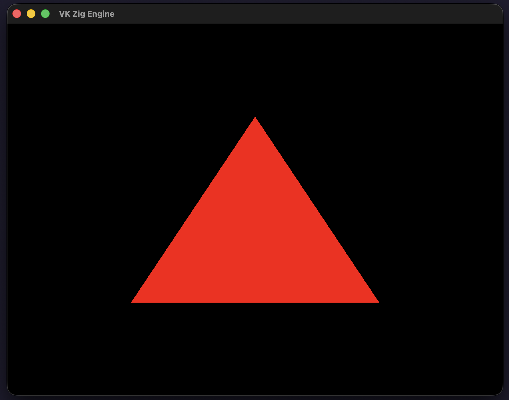

# VK Zig Engine

A Vulkan engine built with Zig, using GLFW for windowing and MoltenVK for Vulkan support on macOS.

Using and documenting on my personal blog: https://crowsheart.com/

Current state:


## Requirements

- Zig 0.16.0 or later
- [GLFW](https://www.glfw.org/) (included via Zig package)
- [MoltenVK](https://vulkan.lunarg.com/) (Vulkan implementation for macOS)

## macOS Setup

Install MoltenVK (Vulkan implementation over Metal):
```bash
brew install molten-vk
```

Create Vulkan ICD configuration:
```bash
sudo mkdir -p /opt/homebrew/share/vulkan/icd.d
```

Create `/opt/homebrew/share/vulkan/icd.d/MoltenVK_icd.json`:
```json
{
    "file_format_version": "1.0.0",
    "ICD": {
        "library_path": "/opt/homebrew/opt/molten-vk/lib/libMoltenVK.dylib",
        "api_version": "1.2.0"
    }
}
```

Set environment variable (add to `~/.zshrc` or `~/.bashrc`):
```bash
export VK_ICD_FILENAMES=/opt/homebrew/share/vulkan/icd.d/MoltenVK_icd.json
```

## Dependencies

- [glfw.zig](https://github.com/tiawl/glfw.zig) - GLFW library for Zig (includes C header translation)
- [cimgui](https://github.com/floooh/cimgui) - C bindings for ImGui (docking branch, used by wrapper)
- MoltenVK Vulkan headers - Used via `translateC` for Vulkan C bindings (`vulkan_c` module)
- ImGui C++ Wrapper (`src/imgui_wrapper/`) - Provides C-linkage functions for ImGui GLFW+Vulkan backends

## Building

```bash
zig build
```

## Running

```bash
zig build run
```

## Testing

```bash
zig build test
```

## Project Structure

```
├── src/
│   ├── main.zig              # Main application entry point
│   ├── headers/
│   │   ├── glfw.h            # C header for GLFW translation
│   │   └── vulkan.h          # C header for Vulkan translation (from MoltenVK)
│   ├── shaders/
│   │   ├── triangle.vert     # Vertex shader (GLSL)
│   │   ├── triangle.frag     # Fragment shader (GLSL)
│   │   ├── triangle.vert.spv # Compiled SPIR-V
│   │   └── triangle.frag.spv # Compiled SPIR-V
│   └── imgui_impl/           # ImGui implementation headers (future use)
├── moltenvk_include/          # Symlink to MoltenVK Vulkan headers
├── lib_search/               # Symlink to Homebrew lib directory
├── build.zig                 # Build configuration
└── build.zig.zon             # Dependency manifest
```

## Usage

Import the modules in your code:

```zig
const glfw = @import("glfw");         // GLFW functions
const vulkan_c = @import("vulkan_c"); // Vulkan C bindings (Vk* types, functions)
const imgui = @import("imgui");       // ImGui C bindings (core functions)
const imgui_wrapper = @import("imgui_wrapper"); // ImGui GLFW+Vulkan backend wrappers
```

### ImGui Integration (Example)

```zig
// Init ImGui backends
imgui_wrapper.imgui_wrapper_glfw_init(window);
imgui_wrapper.imgui_wrapper_vulkan_init(...);

// Per frame
imgui_wrapper.imgui_wrapper_new_frame();
imgui.igBegin("Hello", null, 0);
imgui.igText("Counter: %d", &counter);
imgui.igEnd();
imgui_wrapper.imgui_wrapper_render(command_buffer);

// Shutdown
imgui_wrapper.imgui_wrapper_vulkan_shutdown();
imgui_wrapper.imgui_wrapper_glfw_shutdown();
```

## Current Status

✅ **Completed:**
- GLFW window opens successfully
- Vulkan instance creation: **Working**
- Vulkan surface creation: **Working**
- Physical device selection: **Working**
- Logical device creation: **Working**
- Swapchain + image views: **Working**
- Shader modules (vertex + fragment): **Working**
- Render pass creation: **Working**
- Framebuffer creation: **Working**
- Command pool & buffers: **Working**
- Graphics pipeline: **Working**
- Command recording: **Working**
- Synchronization (semaphores + fences): **Working**
- Main render loop (acquire → submit → present): **Working**
- Basic triangle rendering: **Working** (red triangle on black background)
- ImGui C++ wrapper library: **Implemented** (`src/imgui_wrapper/`)
  - GLFW platform backend (C++ wrapper)
  - Vulkan renderer backend (C++ wrapper)
  - Zig can call via `imgui_wrapper` module

🔧 **Code Review Completed:**
- Fixed physical device selection logic (per-device variables)
- Fixed dangling pointer in swapchain creation
- Replaced `page_allocator` with `DebugAllocator`
- Removed unused vulkan-zig dependency (now using C headers via `translateC`)
- Removed unused `src/c/` directory
- Removed unused `registry/` directory
- Implemented ImGui backend wrapper (Step 1 complete)

📋 **Next Steps:**
- Validation layers for debugging
- Integrate ImGui into main.zig render loop
- Vertex buffers (replace hardcoded shader vertices)
- Depth buffering
- Uniform buffers (MVP matrices)
- Refactor Vulkan logic into separate modules
- Create AppRunner/render loop abstraction
